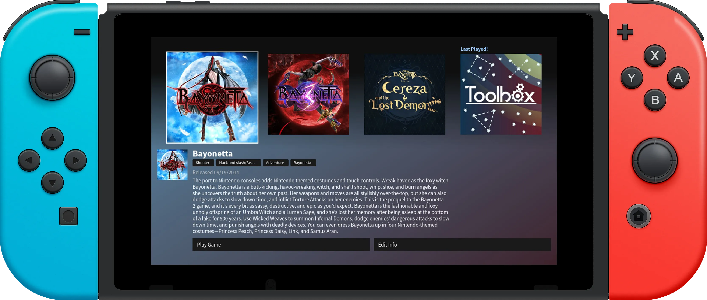

# Switch React Menu



A minimalist home menu for the Nintendo Switch, built with React. This project relies on react-tela, which allows React components to be mounted to a `<canvas>` element instead of a DOM. This allows the nx.js runtime to natively render the components to the screen.

## Features

- Clean, minimalist interface for launching Switch applications
- Smooth pagination for browsing through installed games
- Gamepad support with L/R shoulder buttons and directional controls
- Touch screen support
- Custom font integration (Source Sans Pro)
- Game icon display with truncated titles
- Selected game highlighting

## Technical Stack

- React 18
- TypeScript
- [nx.js](https://github.com/TooTallNate/nx.js) (Nintendo Switch JavaScript runtime)
- [react-tela](https://github.com/TooTallNate/react-tela) (canvas rendering library)
- ESBuild (for NRO/NSP bundle)
- Vite (for browser preview)

## Controls

- **L/R Shoulder Buttons**: Navigate between pages
- **D-Pad/Left Stick**: Navigate between games
- **A Button**: Launch selected game
- **Touch**: Select and launch games directly
- **Touch Navigation**: Use on-screen prev/next buttons

## Project Structure

- `/src` - Source code
  - `/components` - React components (AppIcon, Navigation)
  - `/hooks` - Custom React hooks for gamepad navigation
  - `/lib` - Utility functions
  - `/types` - TypeScript type definitions

## Building From Source (for Switch)

1. Install dependencies

```bash
npm i
```

2. Build the project (application bundle stored in /romfs/)

```bash
npm run build:switch
```

3. Create a corresponding NRO/NSP file (Keys must be supplied for NSP)

```bash
npm run nro # Creates NRO file
npm run nsp # Creates NSP file
```

4. Run the application on the Switch through your preferred Homebrew Launcher!

## Building/Testing in the Browser (DOM)

`react-tela` renders to a generic `<canvas>`, so the same React tree that runs on Switch can be rendered in any modern browser once a few nx.js globals are polyfilled. This repository ships a Vite-based dev/prod pipeline that does exactly that, making it useful for quick iteration without needing to go through NRO/NSP bundling to test!

```bash
npm run dev             # http://localhost:5173 with Hot Module Replacement (HMR)
npm run build:browser   # static bundle in dist/browser
npm run preview         # build + preview the static bundle
```

### How it works

- `index.html` mounts a single `<canvas id="screen">` with a 1280x720 drawing buffer (the Switch's native resolution), CSS-scaled to fit the window it's running in.
- `src/browser/main.tsx` is the browser entry. It installs polyfills for the nx.js globals _before_ dynamically importing `App.tsx`, so app code runs in a sandbox of sorts.
- The polyfills (in `src/browser/polyfills/`) cover everything this project touches:
  | Polyfill | Replaces | Notes |
  |---|---|---|
  | `screen.ts` | `globalThis.screen` | Points at the real `<canvas>`; `screen.width`/`screen.height` return the buffer size. |
  | `fonts.ts` | `globalThis.fonts` | Aliases `document.fonts` so `fonts.add(new FontFace(...))` works. |
  | `switch.ts` | `globalThis.Switch` | Implements `Switch.readFile` (via `fetch`) and `Switch.Application` |
  | `keyboard-gamepad.ts` | `navigator.getGamepads` | Synthesizes a `Gamepad` whose buttons/axes are driven by the keyboard, using the same `Button` enum from `@nx.js/constants`. |
  | `mouse-touch.ts` | the `<canvas>` listener | Turns clicks into `touchstart`/`touchend` events so on-screen tap targets respond to mouse input. |
- Mock applications (`src/browser/mock-data/apps.ts`) generate gradient PNG icons at runtime via `OffscreenCanvas`. To preview real Switch icons instead, drop image files into `public/mock-icons/` and replace `generateIconBytes` with a `fetch()` call.

### Browser keyboard mapping

| Key                      | Switch input                                                          |
| ------------------------ | --------------------------------------------------------------------- |
| `←` `→` `↑` `↓` / `WASD` | D-pad + left stick (`Button.Left/Right/Up/Down`, `axes[0]`/`axes[1]`) |
| `Q` / `E`                | `Button.L` / `Button.R` (page back / forward)                         |
| `1` / `2`                | `Button.ZL` / `Button.ZR`                                             |
| `Enter` `Space` `Z`      | `Button.A` (launch)                                                   |
| `X`                      | `Button.B`                                                            |
| `C` / `V`                | `Button.Y` / `Button.X`                                               |
| `Backspace` `Esc`        | `Button.Minus`                                                        |
| `Tab`                    | `Button.Plus`                                                         |
| Mouse click on canvas    | Synthetic `touchstart`/`touchend` (drives `onTouchStart` props)       |

### Adding new nx.js APIs to the polyfill

When the app starts using a new `Switch.*` API, add a polyfill to `src/browser/polyfills/switch.ts`. Anything left uncovered throws an Exception on its first call, so it's easy to spot missing coverage during development.
